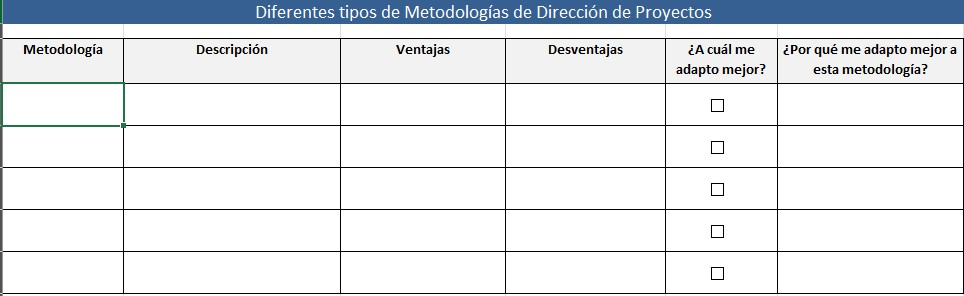
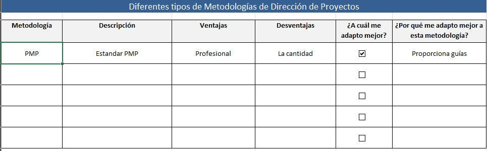

# 1.1. Las Diferentes Metodologías

## Objetivo de la práctica:
Al finalizar la práctica, serás capaz de:
Reconocer las diferentes metodologías, acercamientos y/o estándares aplicados a la dirección de proyectos usados por los participantes en su desarrollo profesional, así como cuál es la metodología más usual.

## Objetivo Visual 
Relacione en el siguiente cuadro las metodologías que ha usado en su desempeño profesional, si no ha utilizado alguna, deje el espacio en blanco. Tome como base las metodologías vistas en clase.

## Duración aproximada:
- 15 minutos.

## Instrucciones 
<!-- Proporciona pasos detallados sobre cómo configurar y administrar sistemas, implementar soluciones de software, realizar pruebas de seguridad, o cualquier otro escenario práctico relevante para el campo de la tecnología de la información -->

### Tarea. Abra el archivo de Excel titulado “1.1.MetodologíasDirecciónProyectos”

### Resultado esperado
Con base en la primera línea del siguiente ejemplo, llenar el cuadro con la información solicitada.

