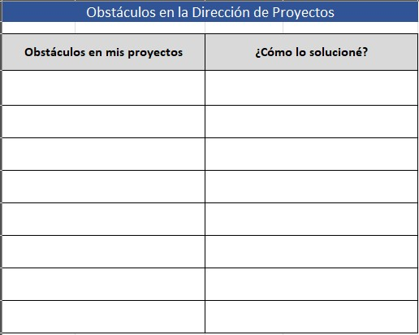
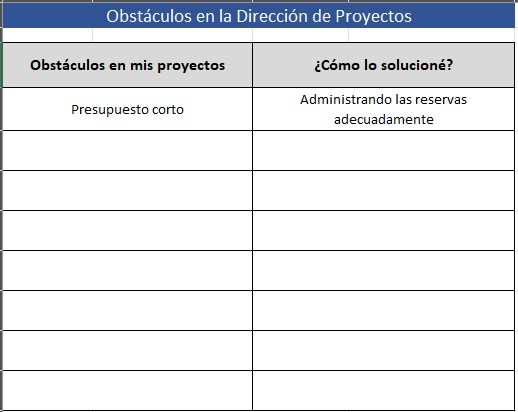

# 1.2. Obstáculos en la Dirección de Proyectos

## Objetivo de la práctica:
Al finalizar la práctica, serás capaz de:

Encontrar un consenso sobre los Obstáculos más comunes en la dirección de proyecto.
## Objetivo Visual 
Relacione en el siguiente cuadro algunos elementos que han obstaculizado el desarrollo de sus proyectos y mencione como lo solucionó.

## Duración aproximada:
- 15 minutos.

## Instrucciones 
<!-- Proporciona pasos detallados sobre cómo configurar y administrar sistemas, implementar soluciones de software, realizar pruebas de seguridad, o cualquier otro escenario práctico relevante para el campo de la tecnología de la información -->

### Tarea. Abra el archivo de Excel titulado “1.2.ObstáculosDirecciónProyectos” y complete la siguiente información: 

•	Obstáculos en mis proyectos: Aquí se registran los principales problemas, dificultades o barreras que se presentaron durante el desarrollo de uno o varios proyectos.

•	¿Cómo lo solucioné?: Explicación concreta de las acciones que tomaste para superar cada obstáculo: estrategias, herramientas, comunicación, apoyo del equipo, etc.

### Resultado esperado
Con base en la primera línea del siguiente ejemplo, llenar el cuadro con la información solicitada:

