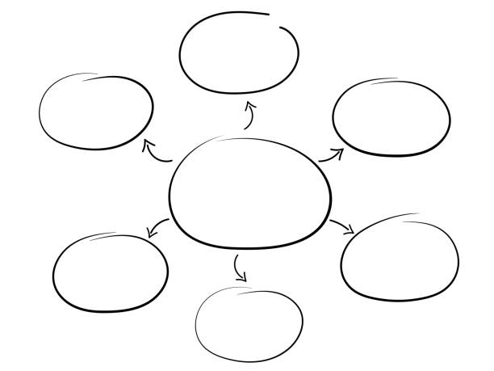
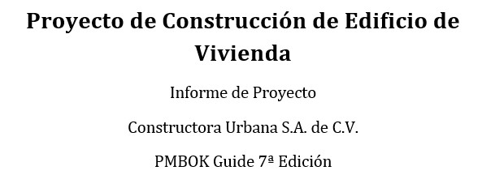
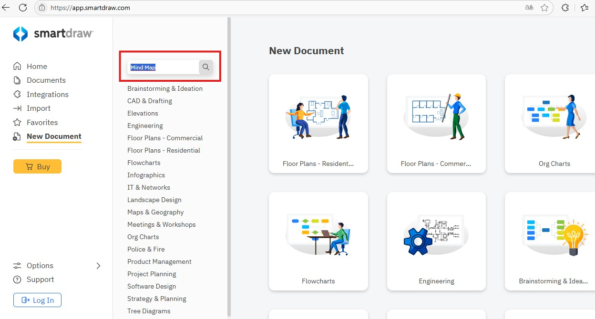
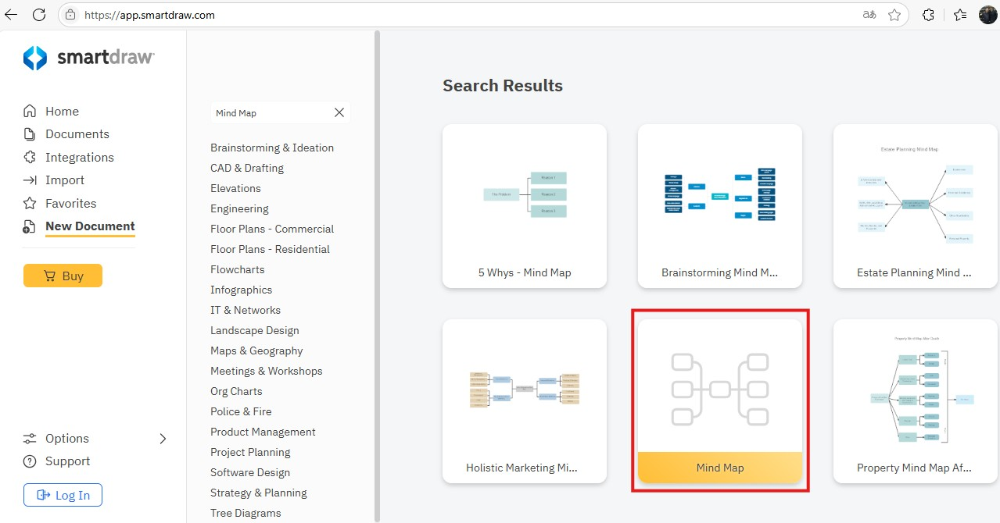
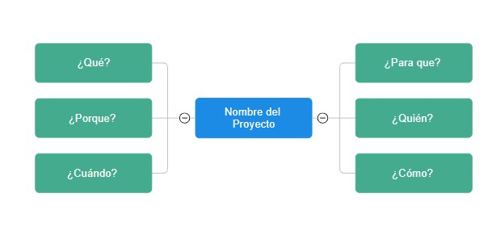

# 2.1. Las Diferentes Metodologías

## Objetivo de la práctica:
Al finalizar la práctica, serás capaz de:

Entender la importancia de conocer y comprender el caso de negocio como una herramienta que permite que los objetivos estratégicos del negocio sean tomados en cuenta para el proyecto.

## Objetivo Visual 
Lea el caso de estudio de su preferencia y realice un mapa mental de acuerdo a su comprensión.

## Duración aproximada:
- 45 minutos.
## Instrucciones 
<!-- Proporciona pasos detallados sobre cómo configurar y administrar sistemas, implementar soluciones de software, realizar pruebas de seguridad, o cualquier otro escenario práctico relevante para el campo de la tecnología de la información -->
### Tarea1. Leer el caso de estudio de su preferencia:
Opción 1. Caso de estudio de Tecnología. Abra el archivo PDF titulado “2.1.CasoNegocioTecnología”

Opción 2. Caso de estudio de Construcción. Abra el archivo PDF titulado “2.1.CasoNegocioConstrucción”

### Tarea2.  Hacer un mapa mental con los principales elementos y afectaciones al proyecto, identificando: ¿Qué?, ¿Por qué? ¿cuándo? ¿Para qué? ¿Quién? ¿Cómo? entre otros datos.
Opción 1: Puede realizarlo manualmente y tomarle una foto si desea compartirlo o usar la herramienta de su preferencia.

Opción 2: Puede usar la siguiente herramienta online que no requiere registro y siguiendo los siguientes pasos:
1.	Ingresar a https://app.smartdraw.com/
2.	Buscar “Mind Map”
   

3.	Seleccionar la plantilla “Mind Map”

### Resultado esperado
Con base en el siguiente ejemplo, reemplazar los textos con la información solicitada:

