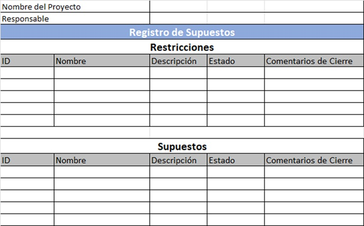
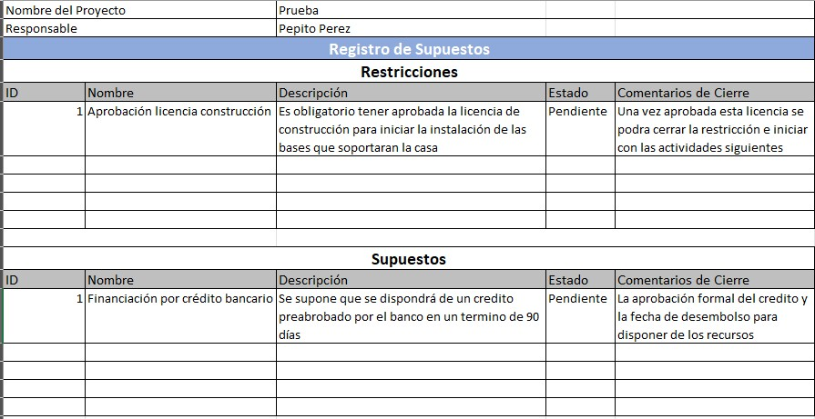

# 3.1. Registro de Supuestos

## Objetivo de la práctica:
Al finalizar la práctica, serás capaz de:

Reconocer la importancia de registrar los supuestos realizados en el inicio del proyecto y por qué estos se analizarán en las siguientes etapas para estar preparados para afrontarlos.
## Objetivo Visual 
Relacione en el siguiente cuadro algunos supuestos y restricciones de acuerdo a la lectura del caso de estudio o de su experiencia profesional.

## Duración aproximada:
- 30 minutos.

## Instrucciones 
<!-- Proporciona pasos detallados sobre cómo configurar y administrar sistemas, implementar soluciones de software, realizar pruebas de seguridad, o cualquier otro escenario práctico relevante para el campo de la tecnología de la información -->

### Tarea. Abra el archivo de Excel titulado “3.1.RegistroSupuestos”

### Resultado esperado
Con base en las dos líneas del siguiente ejemplo, llenar el cuadro con la información solicitada:

