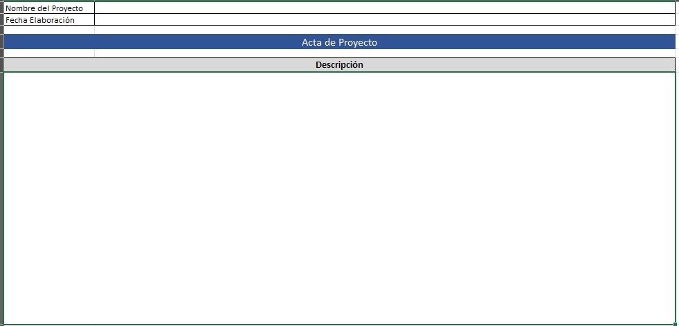
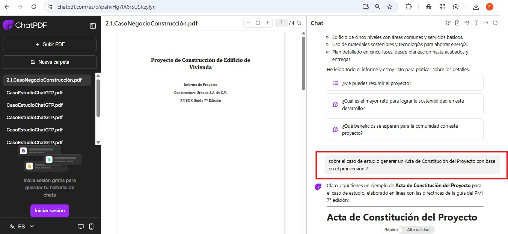
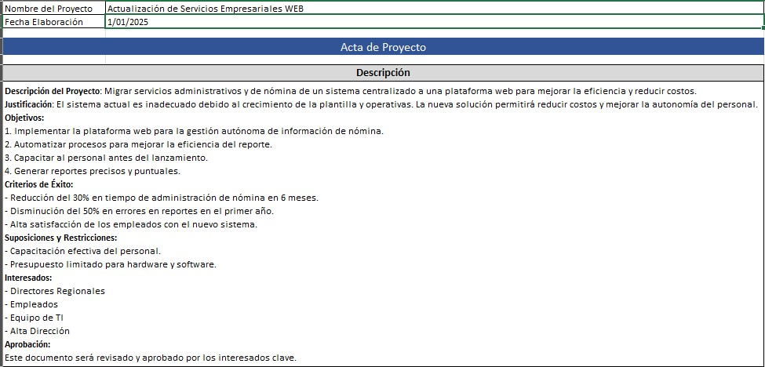

# 3.3. Acta de Constitución

## Objetivo de la práctica:
Al finalizar la práctica, serás capaz de:

Identificar los principales elementos que debe contener el acta de proyecto, así como las bondades de este documento.

## Objetivo Visual 
Genere un acta de constitución, identificando por lo menos: descripción del proyecto, justificación, objetivos, criterios de éxito, suposiciones y restricciones, interesados, aprobación más otros elementos que desee adicionar.

## Duración aproximada:
- 30 minutos.
## Instrucciones 
<!-- Proporciona pasos detallados sobre cómo configurar y administrar sistemas, implementar soluciones de software, realizar pruebas de seguridad, o cualquier otro escenario práctico relevante para el campo de la tecnología de la información -->
### Tarea1. Generar un acta de constitución, identificando por lo menos: descripción del proyecto, justificación, objetivos, criterios de éxito, suposiciones y restricciones, interesados, aprobación más otros elementos que desee adicionar.
Opción 1. Revise el caso de estudio de su preferencia, analice la información solicitada y regístrela en el archivo de Excel titulado “3.3.ActaConstitución”

Opción 2: Puede usar la siguiente herramienta online de inteligencia artificial generativa que no requiere registro y siguiendo los siguientes pasos:
1.	Ingresar a https://www.chatpdf.com/es

2.	Arrastrar a la herramienta del navegador el caso de estudio de su preferencia y escribir las instrucciones (prompt) para generar el acta de constitución a partir del caso. En la parte derecha de la imagen se resalta en rojo un ejemplo del prompt, el cual lo pueden tomar como base y ampliarlo más para obtener mayor detalle en el resultado.

3.	Copiar la información generada en el archivo de Excel titulado “3.3.ActaConstitución”

### Resultado esperado
Con base en el siguiente ejemplo, reemplazar los textos con la información solicitada:

