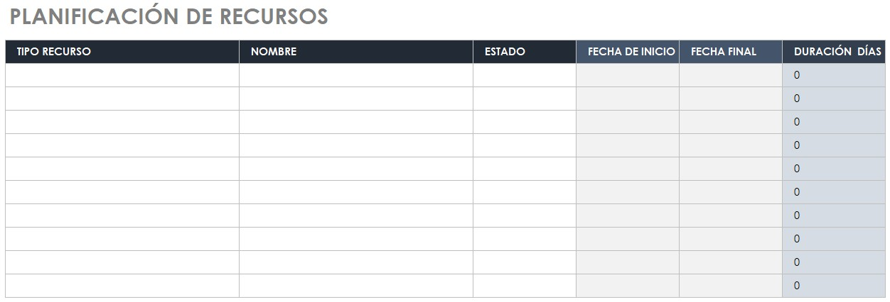
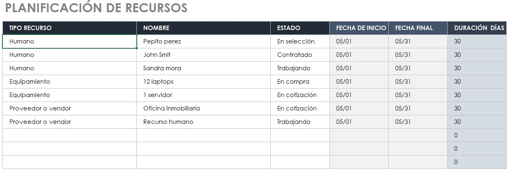

# 4.1. Planificación de Recursos

## Objetivo de la práctica:
Al finalizar la práctica, serás capaz de:

Analizar los recursos que se requieren antes de empezar con cada etapa del proyecto, para adaptarse a la disponibilidad de los recursos humanos y materiales o solicitar los que necesitará.
## Objetivo Visual 
Tomando en cuenta el caso de estudio o su experiencia profesional y de acuerdo el acta de constitución, determine que tipo de recursos deberían tener disponibles antes de iniciar cada etapa del proyecto.

## Duración aproximada:
- 30 minutos.

## Instrucciones 
<!-- Proporciona pasos detallados sobre cómo configurar y administrar sistemas, implementar soluciones de software, realizar pruebas de seguridad, o cualquier otro escenario práctico relevante para el campo de la tecnología de la información -->

### Tarea. Abra el archivo de Excel titulado “4.1.PlanificaciónRecursos”

### Resultado esperado
Con base en el siguiente ejemplo, llenar el cuadro con la información solicitada:

