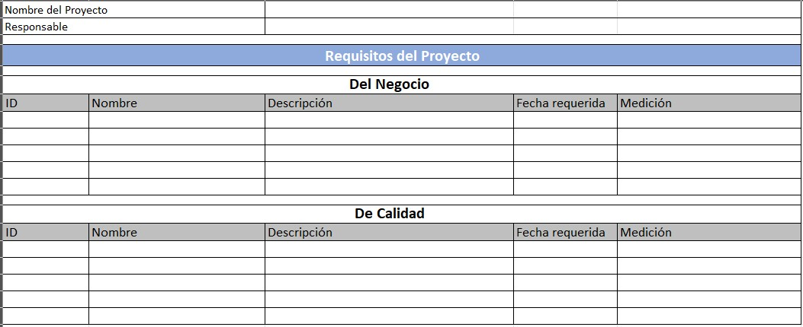
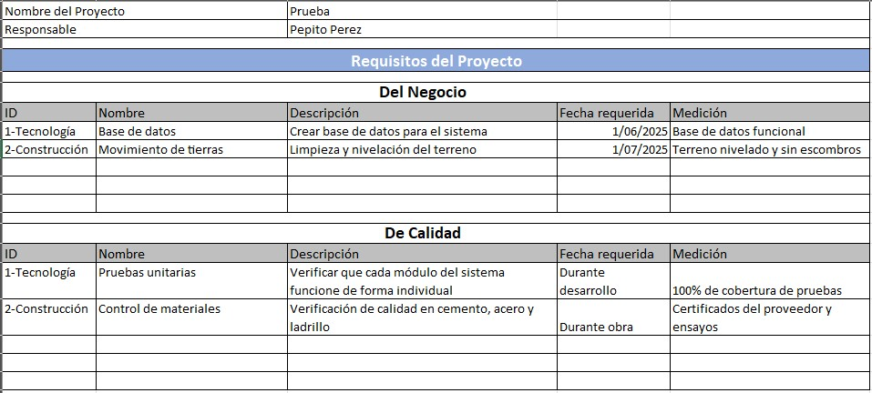
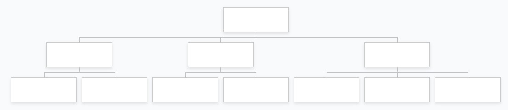
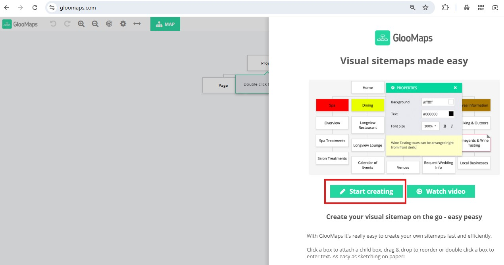
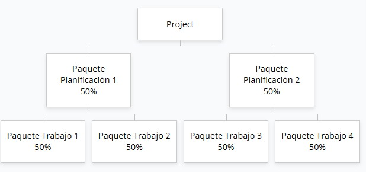

# 4.2. Alcance del Proyecto
Se realizan dos prácticas que cubren el alcance del proyecto y alineadas con los capítulos correspondientes.

# 4.2.1. Registro de Requisitos

## Objetivo de la práctica:
Al finalizar la práctica, serás capaz de:

Identificar y clasificar los requisitos identificados en los documentos que se generan durante la planificación.
## Objetivo Visual 
Tomando en cuenta el caso de estudio o su experiencia profesional y de acuerdo el acta de constitución y el registro de supuestos, determine los requisitos del negocio y de calidad que se deben cumplir al término del proyecto

## Duración aproximada:
- 25 minutos.

## Instrucciones 
<!-- Proporciona pasos detallados sobre cómo configurar y administrar sistemas, implementar soluciones de software, realizar pruebas de seguridad, o cualquier otro escenario práctico relevante para el campo de la tecnología de la información -->

### Tarea. Abra el archivo de Excel titulado “4.2.RegistroRequisitos” y complete la siguiente información: 

•	ID: Identificador único para cada requisito, facilita su seguimiento y referencia.

•	Nombre: Título breve o nombre del requisito que lo identifica claramente.

•	Descripción: Explicación detallada del requisito, especificando qué se necesita o debe cumplirse.

•	Fecha requerida: Fecha límite en la que el requisito debe estar cumplido o implementado.

•	Medición: Criterio o indicador que permite evaluar si el requisito fue cumplido correctamente.

### Resultado esperado
Con base en el siguiente ejemplo, en donde los ID 1 corresponden a proyectos de IT y los ID 2 a proyectos de construcción, llenar el cuadro con la información solicitada:

 
# 4.2.2. Creación de la EDT
## Objetivo de la práctica:
Al finalizar la práctica, serás capaz de:

Entender la importancia de identificar y desglosar los entregables para determinar el trabajo requerido para completar el proyecto.
## Objetivo Visual 
Tomando en cuenta el caso de estudio o su experiencia profesional, determine los entregables necesarios para completar el proyecto.

## Duración aproximada:
- 25 minutos.

## Instrucciones 
<!-- Proporciona pasos detallados sobre cómo configurar y administrar sistemas, implementar soluciones de software, realizar pruebas de seguridad, o cualquier otro escenario práctico relevante para el campo de la tecnología de la información -->

### Tarea. Desglosar e identificar los paquetes de planificación y los paquetes de trabajo en sustantivo y aplicando la regla del 100%.
Opción 1: Puede realizarlo manualmente y tomarle una foto si desea compartirlo o usar la herramienta de su preferencia.

Opción 2: Puede usar la siguiente herramienta online que no requiere registro y siguiendo los siguientes pasos:
1.	Ingresar a https://www.gloomaps.com/

2.	Iniciar la creación como se indica en la parte derecha de la imagen en el cuadro resaltado en rojo, botón “Start creating”

### Resultado esperado
Con base en el siguiente ejemplo, llenar la información solicitada:

