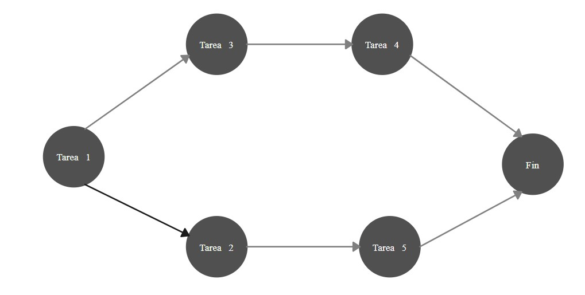
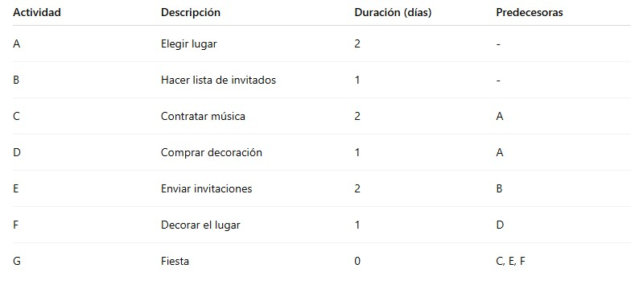

# 4.3. Ruta Crítica

## Objetivo de la práctica:
Al finalizar la práctica, serás capaz de:

Hacer los cálculos correctos para mostrar la secuencia de actividades necesarias para completar el trabajo del proyecto y establecerá la ruta crítica.

## Objetivo Visual 
Siguiendo el ejercicio identifique la secuencia de actividades que establecerán la ruta crítica.

## Duración aproximada:
- 25 minutos.

## Instrucciones 
<!-- Proporciona pasos detallados sobre cómo configurar y administrar sistemas, implementar soluciones de software, realizar pruebas de seguridad, o cualquier otro escenario práctico relevante para el campo de la tecnología de la información -->

### Tarea. Identificar las rutas desde el inicio hasta la actividad final G:
A continuación, se listan las actividades necesarias para organizar una fiesta, junto con sus duraciones y dependencias:

### Resultado esperado
1.  A → C → G = 2 + 2 + 0 = 4 días
2.  A → D → F → G = 2 + 1 + 1 + 0 = 4 días
3.  B → E → G = 1 + 2 + 0 = 3 días

