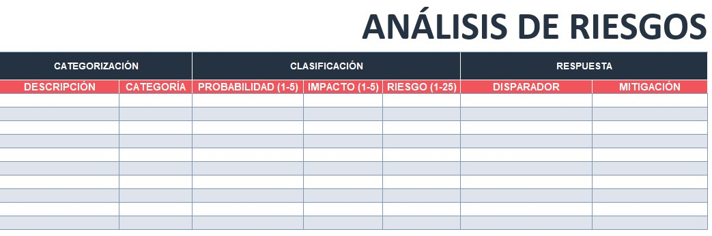
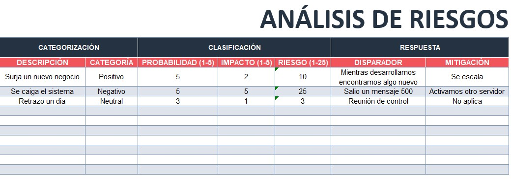

# 4.5. Riesgos

## Objetivo de la práctica:
Al finalizar la práctica, serás capaz de:

Identificar y analizar los riesgos que afectan al proyecto y establecer los planes de mitigación necesarios para afrontar dichos riesgos

## Objetivo Visual 
Tomando en cuenta el caso de estudio o su experiencia profesional, identifique amenazas y oportunidades a las que se podría enfrentarse el proyecto y escríbalas en el formato de Registro de Riesgos, así mismo evalúe la probabilidad y el impacto de cada riesgo para establecer su severidad y la posible acción para mitigarlos.

## Duración aproximada:
- 25 minutos.

## Instrucciones 
<!-- Proporciona pasos detallados sobre cómo configurar y administrar sistemas, implementar soluciones de software, realizar pruebas de seguridad, o cualquier otro escenario práctico relevante para el campo de la tecnología de la información -->

### Tarea. Abra el archivo de Excel titulado “4.4.Riesgos” y complete la siguiente información: 

•	Descripción: Detalle específico del riesgo identificado.

•	Categoría: Tipo o grupo al que pertenece el riesgo (ej. técnico, financiero, operativo, externo).

•	Probabilidad (1-5): Nivel estimado de ocurrencia del riesgo, donde 1 es muy baja y 5 es muy alta.

•	Impacto (1-5): Grado de afectación que tendría el riesgo si ocurre, de 1 (bajo) a 5 (alto).

•	Riesgo (1-25): Valor calculado multiplicando probabilidad × impacto, usado para priorizar riesgos.

•	Disparador: Evento o condición que indica que el riesgo está a punto de ocurrir o ya sucedió.

•	Mitigación: Acciones planificadas para reducir la probabilidad o impacto del riesgo.

### Resultado esperado
Con base en las primeras tres líneas de ejemplo, llenar el cuadro con la información solicitada:

