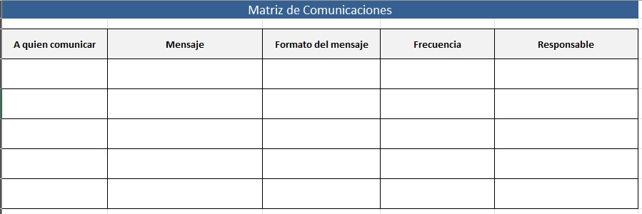
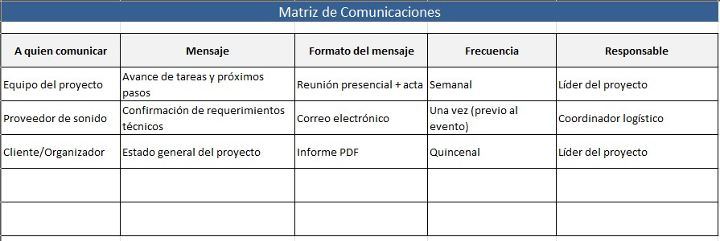

# 4.5. Comunicaciones

## Objetivo de la práctica:
Al finalizar la práctica, serás capaz de:

Establecer elementos para la ejecución y seguimiento de las comunicaciones en el proyecto.

## Objetivo Visual 
Tomando en cuenta su experiencia laboral, el acta de proyecto y el registro y la evaluación de los interesados, cree la matriz de comunicaciones.

## Duración aproximada:
- 20 minutos.

## Instrucciones 
<!-- Proporciona pasos detallados sobre cómo configurar y administrar sistemas, implementar soluciones de software, realizar pruebas de seguridad, o cualquier otro escenario práctico relevante para el campo de la tecnología de la información -->

### Tarea. Abra el archivo de Excel titulado “4.5.MatrizComunicaciones” y complete la siguiente información.
•	A quien comunicar: Al o los interesados identificados (puede formar grupos de interesados)

•	Mensaje: Que información debe comunicar (sobre el tiempo, costo, alcance, calidad, etc.)

•	Formato del mensaje: Establezca si el mensaje debe ser formal, informal, oral o escrito

•	Frecuencia: Derivado del análisis de importancia de los interesados, establezca con que tanta frecuencia deberán ser informados (Fecha o periodo de tiempo)

•	Responsable: Quien será responsable de emitir dicha comunicación

### Resultado esperado
Con base en el ejemplo, llenar el cuadro con la información solicitada:

