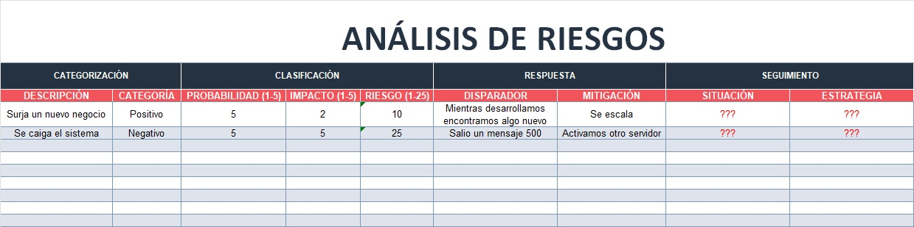
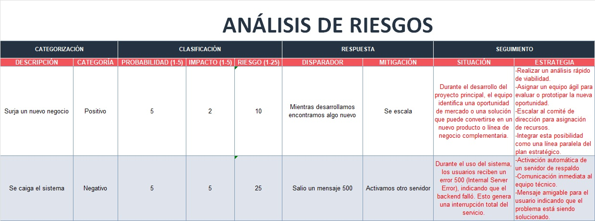

# 5.1. Seguimiento a Riesgos

## Objetivo de la práctica:
Al finalizar la práctica, serás capaz de:

Entender la importancia e implicaciones de un seguimiento a los disparadores de riesgo que ponen de manifiesto la inminencia de un evento que afectará a nuestro trabajo y que marca la pauta para implementar los planes de contingencia planeados

## Objetivo Visual 
Tomando en cuenta el registro de riesgos ya realizado, determine qué plan de contingencia establecido debe implementar.

## Duración aproximada:
- 30 minutos.

## Instrucciones 
<!-- Proporciona pasos detallados sobre cómo configurar y administrar sistemas, implementar soluciones de software, realizar pruebas de seguridad, o cualquier otro escenario práctico relevante para el campo de la tecnología de la información -->

### Tarea. Abra el archivo de Excel titulado “5.1.SeguimientoRiesgos” y complete la siguiente información.
•	Situación: Entendimiento de lo que está sucediendo.

•	Estrategia: Basado en el registro de riesgos determine que estrategia de atención a riesgos debe implementar.

### Resultado esperado
Con base en el ejemplo de las columnas Situación y Estrategia, ambas resaltadas en rojo, llenar el cuadro con la información solicitada:

