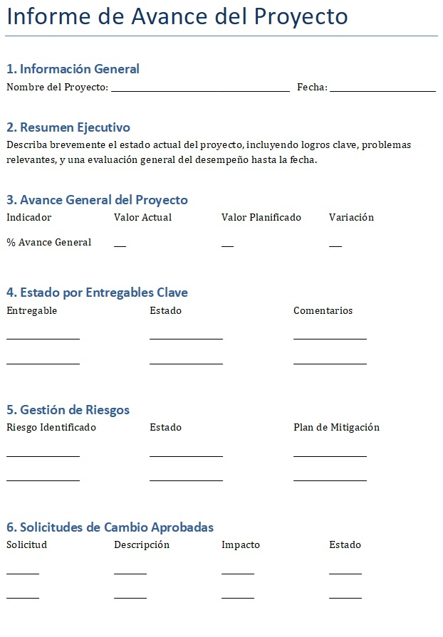
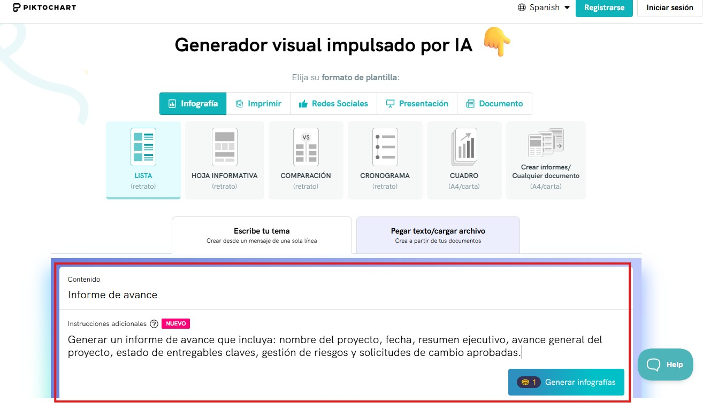
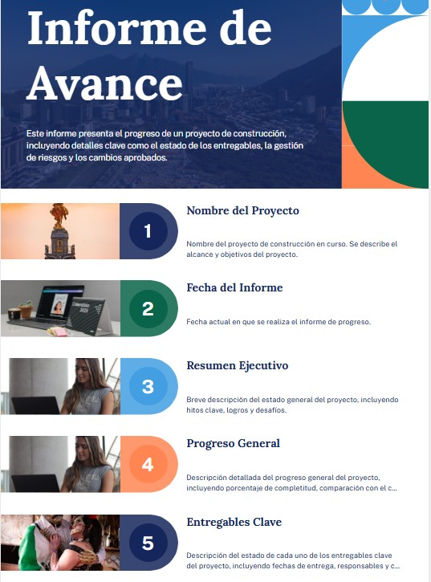

# 5.2. Informe de Avance
## Objetivo de la práctica:
Al finalizar la práctica, serás capaz de:

Identificar los elementos principales que debe tomar en cuenta en una reunión de avance a fin de hacerla lo más efectiva posible
## Objetivo Visual 
Tomando en cuenta la matriz de comunicaciones, el escenario de riesgos y su experiencia profesional, realice un informe para una reunión de seguimiento en esta fase de ejecución.

## Duración aproximada:
- 30 minutos.

## Instrucciones 
<!-- Proporciona pasos detallados sobre cómo configurar y administrar sistemas, implementar soluciones de software, realizar pruebas de seguridad, o cualquier otro escenario práctico relevante para el campo de la tecnología de la información -->

### Tarea. Generar un informe de avance que incluya: nombre del proyecto, fecha, resumen ejecutivo, avance general del proyecto, estado de entregables claves, gestión de riesgos y solicitudes de cambio aprobadas.
Opción 1: Puede realizarlo usando el archivo de Word titulado “5.2.InformeAvance”.

Opción 2: Puede usar la siguiente herramienta online de inteligencia artificial generativa que no requiere registro y siguiendo los siguientes pasos:
1.	Ingresar a https://piktochart.com/generative-ai/editor/

2.	Escribir las instrucciones (prompt) para generar informe de avance. En la parte inferior de la imagen se resalta en rojo un ejemplo del prompt (que es el mismo descrito en esta tarea), el cual lo pueden tomar como base y ampliarlo más para obtener mayor detalle en el resultado.

### Resultado esperado
Con base en el siguiente ejemplo, generar la información solicitada:

