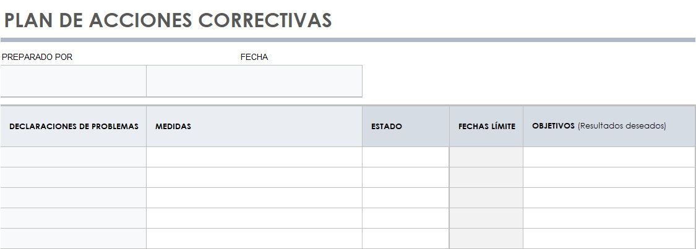
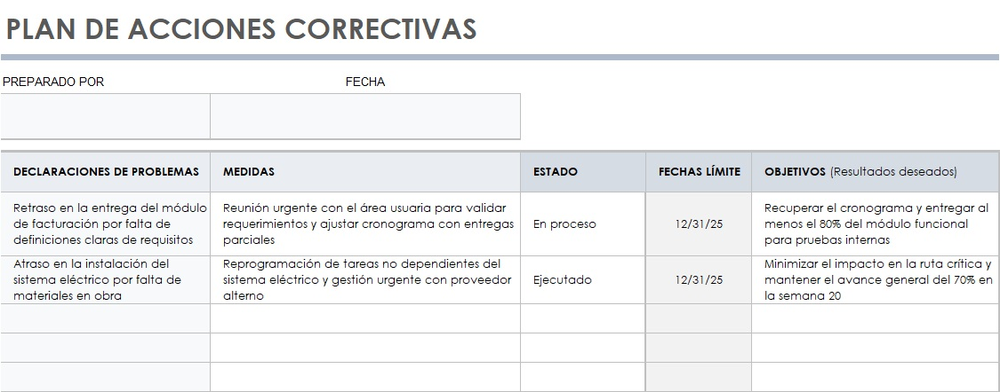

# 6.1. Cambios

## Objetivo de la práctica:
Al finalizar la práctica, serás capaz de:

Entender la importancia de gestionar los cambios al proyecto de una forma adecuada para evitar desviar el proyecto del objetivo.

## Objetivo Visual 
Tomando en cuenta el registro de riesgos y su experiencia profesional, solicitar de manera adecuada una o más acciones correctivas para que sean aprobadas e implementadas de manera oportuna.

## Duración aproximada:
- 30 minutos.

## Instrucciones 
<!-- Proporciona pasos detallados sobre cómo configurar y administrar sistemas, implementar soluciones de software, realizar pruebas de seguridad, o cualquier otro escenario práctico relevante para el campo de la tecnología de la información -->

### Tarea. Abra el archivo de Excel titulado “6.1.AccionesCorrectivas” y complete la siguiente información
•	DECLARACIONES DE PROBLEMAS: Descripción clara del problema que afecta al proyecto.

•	MEDIDAS: Acciones correctivas propuestas o ejecutadas para solucionar el problema.

•	ESTADO: Situación actual de la medida (ej. "En proceso", "Ejecutado", "Pendiente").

•	FECHAS LÍMITE: Plazo máximo para implementar la medida.

•	OBJETIVOS (Resultados deseados): Lo que se espera lograr con la medida aplicada.
### Resultado esperado
Con base en el ejemplo de las columnas Situación y Estrategia, ambas resaltadas en rojo, llenar el cuadro con la información solicitada:

