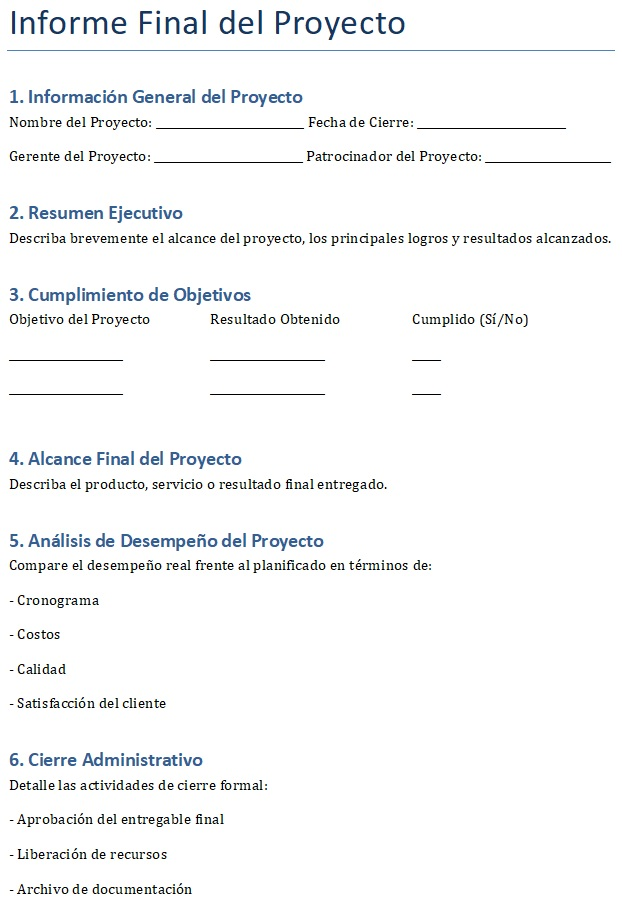
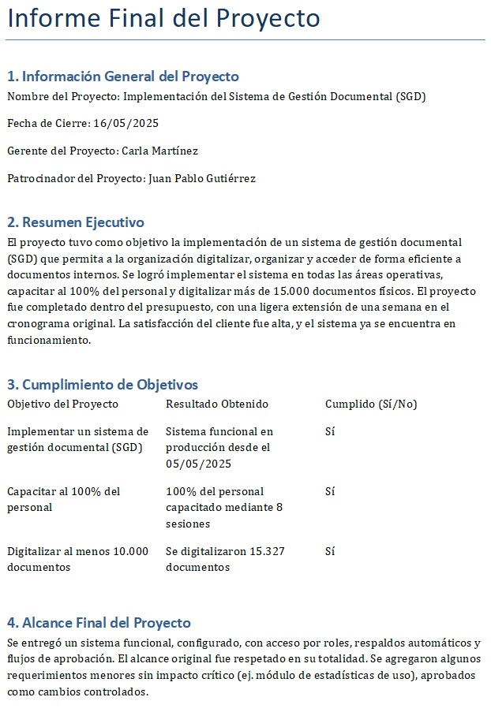
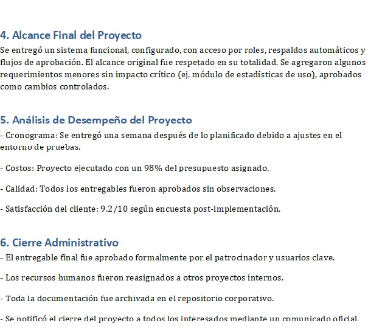

# 7.1. Informe Final

## Objetivo de la práctica:
Al finalizar la práctica, serás capaz de:

Entender la importancia de elaborar un informe final del proyecto, como una herramienta que demuestra lo que se completó o logro dentro del proyecto.

## Objetivo Visual 
Tomando en cuenta su experiencia profesional, el acta de proyecto, los riesgos presentados y las acciones correctivas, desarrollar un informe final del proyecto en el que se contraste lo planeado con lo que se logró al término del proyecto.

## Duración aproximada:
- 30 minutos.

## Instrucciones 
<!-- Proporciona pasos detallados sobre cómo configurar y administrar sistemas, implementar soluciones de software, realizar pruebas de seguridad, o cualquier otro escenario práctico relevante para el campo de la tecnología de la información -->

### Tarea. Abra el archivo de Excel titulado “7.1.InformeFinal” y complete la siguiente información: 
•	Información General del Proyecto

•	Resumen Ejecutivo

•	Cumplimiento de Objetivos

•	Alcance Final del Proyecto

•	Análisis de Desempeño del Proyecto 

•	Cierre Administrativo

### Resultado esperado
Con base en el ejemplo, llenar el informe con la información solicitada:

