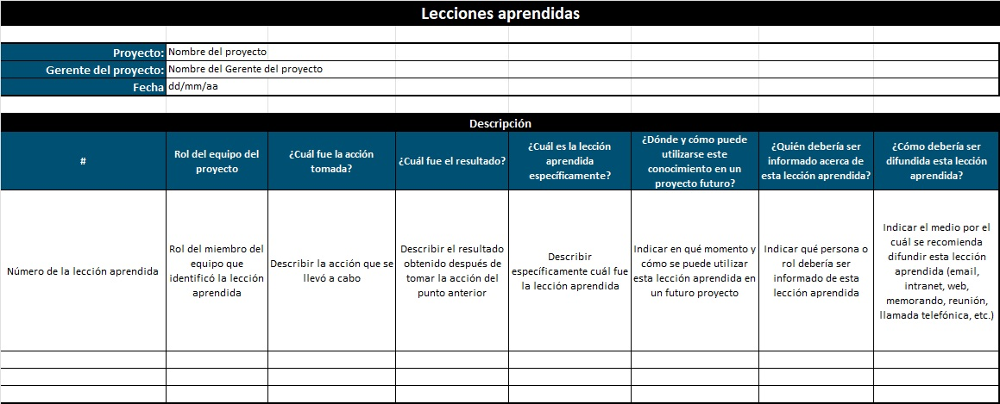
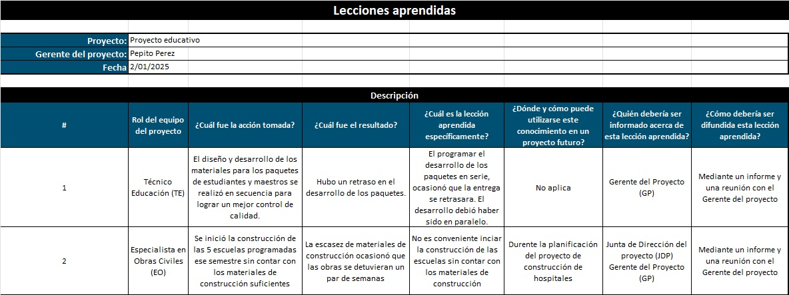

# 7.2. Lecciones Aprendidas

## Objetivo de la práctica:
Al finalizar la práctica, serás capaz de:

Registrar los elementos aprendidos en el proyecto e identificará la importancia de esta actividad en el proyecto

## Objetivo Visual 
Tomando en cuenta su experiencia profesional y el desarrollo de los ejercicios, registrar lo que se aprendió durante la ejecución del proyecto.

## Duración aproximada:
- 15 minutos.

## Instrucciones 
<!-- Proporciona pasos detallados sobre cómo configurar y administrar sistemas, implementar soluciones de software, realizar pruebas de seguridad, o cualquier otro escenario práctico relevante para el campo de la tecnología de la información -->

### Tarea. Abra el archivo de Excel titulado “7.2.LeccionesAprendidas” y complete la siguiente información: 
•	Rol del equipo del proyecto: Rol del miembro del equipo que identificó la lección aprendida

•	¿Cuál fue la acción tomada?: Describir la acción que se llevó a cabo

•	¿Cuál fue el resultado?: Describir el resultado obtenido después de tomar la acción del punto anterior

•	¿Cuál es la lección aprendida específicamente?: Describir específicamente cuál fue la lección aprendida

•	¿Dónde y cómo puede utilizarse este conocimiento en un proyecto futuro?: Indicar en qué momento y cómo se puede utilizar esta lección aprendida en un futuro proyecto

•	¿Quién debería ser informado acerca de esta lección aprendida?: Indicar qué persona o rol debería ser informado de esta lección aprendida

•	¿Cómo debería ser difundida esta lección aprendida?: Indicar el medio por el cual se recomienda difundir esta lección aprendida (email, intranet, web, memorando, reunión, llamada telefónica, etc.)

### Resultado esperado
Con base en el ejemplo, llenar el informe con la información solicitada:

